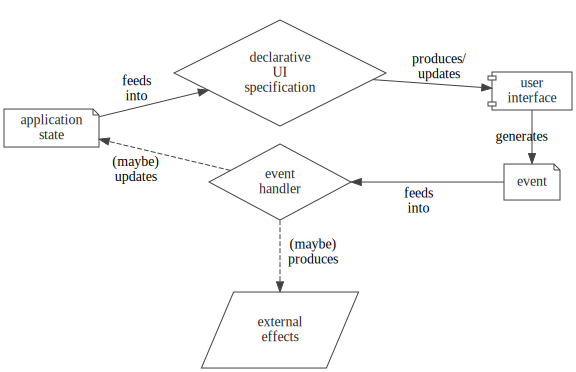

High-Level Flow
===============

<script>
    init_alia_demos(['hello-button']);
</script>

This section will focus on how alia applications handle changes over time: how
events happen, how to respond to them, and how to explicitly handle the passage
of time. First, let's take a look at the flow of an alia application from a
high-level perspective...

The flow of a declarative user interface system generally looks something like
this:



The important part is that UI event handlers don't directly manipulate the UI
but instead translate those events to *changes in application state*, which are
then reflected in the UI via the declarative UI specification.

In alia, both the declarative UI specification and the event handlers are part
of the *controller function:*


The controller function is just the top-level component in a user interface.
From a high-level perspective, it serves two purposes:

1. It declares what components are present in the user interface.

2. It delivers events to those components.

Here's a very simple example that demonstrates both of these roles:

```cpp
void
demo_ui(html::context ctx, duplex<bool> show_message)
{
    html::button(ctx, "Toggle the Message", actions::toggle(show_message));

    alia_if(show_message)
    {
        html::p(ctx, "Hello, World!");
    }
    alia_end
}
```

<div class="demo-panel">
<div id="hello-button"></div>
</div>

When you interact with this demo, the sequence of events is as follows:

1. The alia/HTML system invokes `demo_ui` to determine the initial contents of
   the UI, and in response to what `demo_ui` declares, a 'Toggle the Message'
   button is created.

2. At some point, you (the user) click the button and alia/HTML invokes
   `demo_ui` again with a button click event. `demo_ui` calls `html::button`,
   and `html::button` recognizes that the button click event is meant for it,
   so it invokes its [action](actions.md), which toggles the state of
   `show_message`.

3. Immediately after this, alia/HTML invokes `demo_ui` *again* to refresh the
   UI. `demo_ui` again declares that the 'Toggle the Message' button should be
   there, but since `show_message` is now set to `true`, it *also* declares
   that the 'Hello, World!' message should be included.

... And so on.

Note that all of this is transparent to `demo_ui`. The event that's being
transported through the UI tree is tucked away in the context argument. All
`demo_ui` has to do is declare what should be there and what it should do. The
leaves of the tree (e.g., `html::button`) worry about what type of event is
being processed and how to respond to it. (In fact, steps 1 and 3 above are
actually just 'refresh' events. `html::button` responds to refresh events by
making sure that there is a button in the DOM where it should be and that the
label is correct.)
